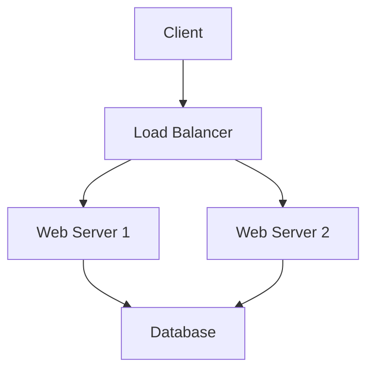

# System Design Learning Platform

A modern, interactive web application for learning System Design concepts through lectures, quizzes, and community discussions.


## 🚀 Features

### 📚 **Interactive Lectures**
- Rich content with Markdown-like rendering
- Interactive Mermaid.js diagrams
- Complete CRUD operations
- Progress tracking
- Code syntax highlighting

### 📝 **Interactive Quizzes**
- Multiple choice questions
- Instant feedback and explanations
- Score tracking and retake functionality
- Quiz creation and management
- Linked to lectures

### 💬 **Community Forum**
- Discussion threads with categories
- Reply system
- Category filtering
- User-friendly interface

### 📊 **Progress Tracking**
- Personal dashboard
- Achievement system
- Visual progress indicators
- Local storage persistence

### 🎨 **Modern Design**
- Fully responsive (mobile, tablet, desktop)
- Clean, professional interface
- Tailwind CSS styling
- Accessibility considerations

## 🛠️ Tech Stack

- **Frontend:** React 18, Vite
- **Styling:** Tailwind CSS
- **Routing:** React Router DOM
- **State Management:** React Context
- **Diagrams:** Mermaid.js
- **Testing:** Vitest, React Testing Library
- **Deployment:** Vercel/Netlify ready

## 📁 Project Structure

```
src/
├── assets/           # Static assets
├── components/       # Reusable components
├── context/         # React Context for state management
├── features/        # Feature-based modules
│   ├── lectures/    # Lecture management
│   ├── quizzes/     # Quiz functionality
│   └── forum/       # Community forum
├── layouts/         # Layout components
├── pages/           # Main pages
├── test/           # Test files
└── utils/          # Utility functions
```

## 🚀 Getting Started

### Prerequisites
- Node.js 16+ 
- npm or yarn

### Installation

1. **Clone the repository**
   ```bash
   git clone <repository-url>
   cd CPU
   ```

2. **Install dependencies**
   ```bash
   npm install
   ```

3. **Start development server**
   ```bash
   npm run dev
   ```

4. **Open your browser**
   Navigate to `http://localhost:5173`

## 📜 Available Scripts

- `npm run dev` - Start development server
- `npm run build` - Build for production
- `npm run preview` - Preview production build
- `npm run test` - Run tests
- `npm run lint` - Run ESLint

## 🧪 Testing

The project includes comprehensive tests using Vitest and React Testing Library:

```bash
npm run test
```

Tests cover:
- Component rendering
- User interactions
- Navigation
- State management

## 🚀 Deployment

### Vercel
1. Connect your GitHub repository to Vercel
2. Deploy automatically on push to main branch

### Netlify  
1. Connect your GitHub repository to Netlify
2. Deploy automatically with `netlify.toml` configuration

## 🎯 Usage Guide

### Creating Lectures
1. Navigate to **Lectures** → **Add Lecture**
2. Fill in title, description, and content
3. Use Markdown syntax for formatting
4. Add Mermaid diagrams with \`\`\`mermaid blocks
5. Include code examples with \`\`\`language blocks

### Creating Quizzes
1. Go to **Quizzes** → **Add Quiz**
2. Set title, description, and related lecture
3. Add questions with multiple choice answers
4. Select correct answers and add explanations

### Forum Participation
1. Visit **Forum** → **New Discussion**
2. Choose category and write your question/topic
3. Engage with existing threads
4. Reply to help others learn

### Tracking Progress
1. Check **Progress** page for overview
2. View completion status
3. See achievements unlocked
4. Monitor quiz scores

## 🌟 Key Features Explained

### Mermaid Diagrams
Create interactive diagrams in lectures:



### Local Storage
- All data persists locally
- No authentication required for MVP
- Ready for backend integration

### Responsive Design
- Mobile-first approach
- Tablet and desktop optimized
- Touch-friendly interface

## 🔧 Customization

### Adding New Features
1. Create new components in appropriate feature folders
2. Update routing in `App.jsx`
3. Add state management in `AppContext.jsx`
4. Style with Tailwind CSS

### Themes
Customize colors in `tailwind.config.js`:

```javascript
theme: {
  extend: {
    colors: {
      primary: {...}
    }
  }
}
```

## 🤝 Contributing

1. Fork the repository
2. Create feature branch (`git checkout -b feature/amazing-feature`)
3. Commit changes (`git commit -m 'Add amazing feature'`)
4. Push to branch (`git push origin feature/amazing-feature`)
5. Open Pull Request

## 📋 Future Enhancements

- [ ] User authentication (Firebase/Supabase)
- [ ] Backend integration for data persistence
- [ ] Real-time forum updates
- [ ] Advanced quiz types (code challenges)
- [ ] Video content support
- [ ] Social features (user profiles)
- [ ] Admin moderation tools
- [ ] Advanced analytics

## 📄 License

This project is licensed under the MIT License - see the [LICENSE](LICENSE) file for details.

## 🙏 Acknowledgments

- Built with React + Vite for modern development
- Styled with Tailwind CSS for rapid UI development
- Mermaid.js for beautiful diagrams
- React Router for seamless navigation

---

**Happy Learning! 🎓**
